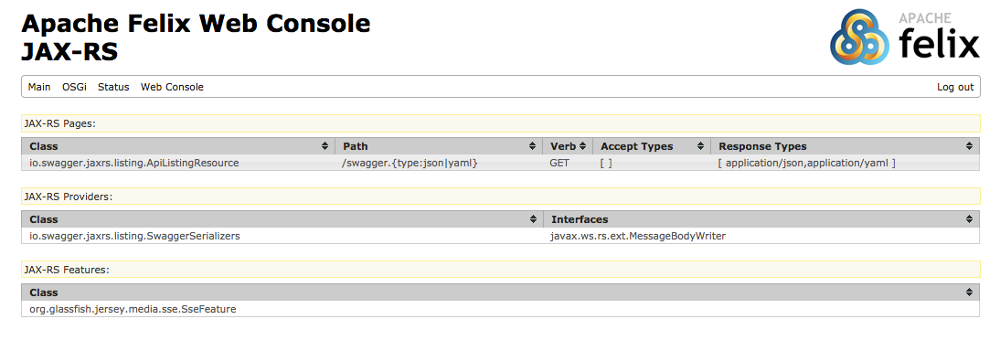

osgi-jaxrs-services
===================

This is a set of OSGi bundles that handles wrapping up Jersey into a bundle that can parse OSGi services to find services that implement JAX-RS logic (pages, providers, and features).

It is largely inspired by [osgi-jax-rs-connector](https://github.com/hstaudacher/osgi-jax-rs-connector) and is fully backwards compatable.

Builds
------
Master: [](https://travis-ci.org/pavlovmedia/osgi-jaxrs-services)
1.0: [](https://travis-ci.org/pavlovmedia/osgi-jaxrs-services)

Reasoning
---------

Since this release is stronly inspired by osgi-jax-rs-connector the question may arise, why do a different one? There are a few answers to that
* It seems that the primary author of the code has moved on to other projects and does not have a lot of time for updates
* There are features that I wanted to add (like webconsole) support
* Because of the project layout, I have yet to figure out how to bring it into eclipse to edit
* By using different faciliies of OSGi and Java 8, I was able to create a drastically smaller runtime.

Requirements
------------

There are 2 requirements to get this running:
1. Java 8
1. The Glassfish/Jersey runtime 

Because this is backwards compatable you can still use the [jersey-all](http://search.maven.org/#artifactdetails%7Ccom.eclipsesource.jaxrs%7Cjersey-all%7C2.22.2%7Cjar) bundle provided by osgi-jax-rs-connector.

gogo shell commands
-------------------

This bundle provides a set of debugging commands that allow you to see what is being passed along to Jersey:

```
jax:getEndpoints
jax:getFeatures
jax:getProviders
```

An example of this in action is to look at the endpoints:
```
g! jax:getEndpoints
JAX-RS Endpoint mappings: 
io.swagger.jaxrs.listing.ApiListingResource
	EndpointInfo: path: /swagger.{type:json|yaml}, verb: GET, respond: [ application/json,application/yaml ]
g! 
```

Webconsole
----------

There is an addtional webconsole module that works with Apache Felix (it may work with others, it has not been tested).

Once installed it will add a JAX-RS section that lists the same information as the gogo commands, but in a table format.



SSE support
-----

Note that since the team developing this makes extensive use of SSE, that feature gets enabled by default. It is, however, an optional import so if you are rolling your own Jersey support and you don't include this bundle, the provider should still start.

Swagger Support
---------------

Swagger support is built into the publisher bundle, but it requires the swagger bundles to be installed. If
they are not present then swagger support won't start. These are optional imports so the system will still
run without those bundles. This is similar to how SSE works.